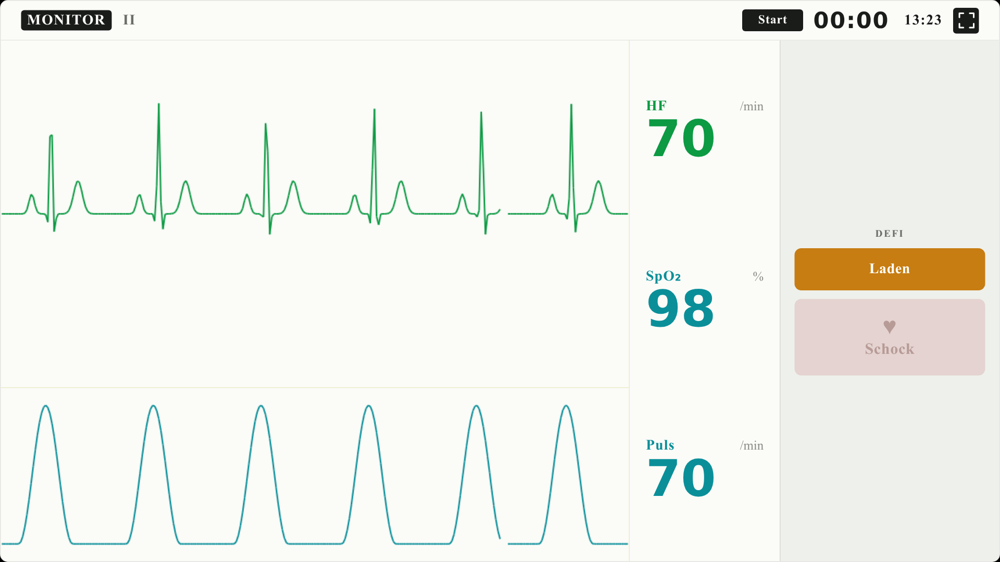
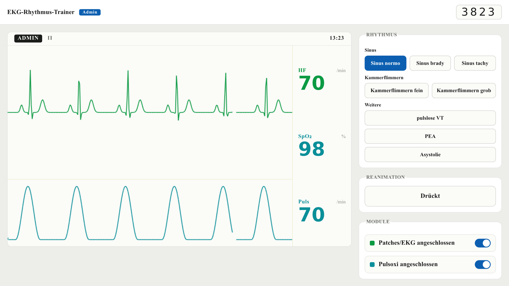

# EKG-Trainer

Ein webbasierter EKG- und Defibrillator-Simulator für Reanimationsfortbildungen –
für alle, die sich die teuren Trainingsgeräte nicht leisten können.

Die Ausbilderin oder der Ausbilder steuert den Herzrhythmus vom eigenen Handy
oder Laptop aus, die Teilnehmenden sehen auf einem anderen Gerät (Tablet, Laptop,
Beamer) einen Patientenmonitor mit laufender EKG-Kurve. Alles, was man braucht,
ist ein Browser.

Öffentliche URL: https://ekg.drk-barmbek.de/



## Warum?

Echte Trainingsdefibrillatoren und Rhythmus-Simulatoren kosten schnell mehrere
tausend Euro. Viele Ortsvereine, Wachen und Ausbildungsgruppen haben dafür kein
Budget – und üben Reanimation dann ohne Monitor, mit ausgedruckten EKG-Streifen
oder mit Ansagen wie „Du siehst jetzt Kammerflimmern“.

Der EKG-Trainer schließt diese Lücke: Ein vorhandenes Tablet neben der
Übungspuppe wird zum Patientenmonitor, und die Ausbildung kann Rhythmuswechsel,
Herzdruckmassage und angeschlossene Module realistisch in das Szenario
einbauen.

## Funktionen

**Für die Ausbildung (Admin-Ansicht)**

- Rhythmus live umschalten:
  - Sinusrhythmus (normofrequent, bradykard, tachykard)
  - Kammerflimmern (fein, grob)
  - pulslose ventrikuläre Tachykardie (pVT)
  - pulslose elektrische Aktivität (PEA)
  - Asystolie
- „Drückt“ an/aus – die Kurve zeigt dann das typische Artefakt der
  Herzdruckmassage
- Module an- und abstecken: Patches/EKG und Pulsoxymeter
- Eine Vorschau des Monitors, wie ihn die Teilnehmenden sehen



**Für die Teilnehmenden (Monitor-Ansicht)**

- EKG-Kurve und Pulsoxymetrie-Kurve im Monitor-Look
- Anzeige von HF, SpO2 und Puls passend zum Rhythmus – bei PEA zum Beispiel
  eine Herzfrequenz im EKG, aber kein Puls und keine SpO2
- Defibrillator mit **Laden**, **Schock** und **Abbrechen**, inklusive Lade-
  und Bereitschaftston; ein Schock erzeugt den Defi-Spike auf der Kurve
- Stoppuhr für die Reanimationszeit
- Vollbildmodus (auf Mobilgeräten im Querformat)

Timer und Defibrillator laufen lokal auf dem jeweiligen Gerät. Ein Schock
verändert den Rhythmus nicht – was nach dem Schock passiert, entscheidet die
Ausbildung.

Alle Monitore einer Sitzung zeigen exakt dieselben Werte. Die Bedienoberfläche
ist auf Deutsch.

## So funktioniert eine Sitzung

1. Auf der Startseite eine neue Sitzung anlegen. Man erhält einen
   **4-stelligen Code** und landet in der Admin-Ansicht.
2. Die Teilnehmenden öffnen die Startseite auf ihren Geräten und geben den
   Code ein. Sie sehen den Monitor.
3. In der Admin-Ansicht Rhythmus, „Drückt“ und Module steuern – alle
   verbundenen Monitore folgen in Echtzeit.

Der Code allein erlaubt nur das Zuschauen. Steuern kann nur, wer den geheimen
Admin-Link hat. Dieser wird im Browser gespeichert, sodass man die Admin-Ansicht
auf demselben Gerät auch ohne den vollständigen Link wieder öffnen kann.
Sitzungen ohne Aktivität werden nach einer Stunde automatisch beendet.

> **Hinweis:** Der EKG-Trainer ist ein Hilfsmittel für die Ausbildung. Er ist
> kein Medizinprodukt und stellt keine echten Patientendaten dar.

## Selbst betreiben

### Voraussetzungen

- Node.js 24 (oder Docker)

### Lokal starten

```bash
npm install
npm run dev
```

Danach läuft die Anwendung unter <http://localhost:3000>. Damit andere Geräte
im selben WLAN beitreten können, die lokale IP-Adresse des Rechners statt
`localhost` verwenden.

### Mit Docker

```bash
docker build -t ekg-trainer .
docker run -p 3000:3000 ekg-trainer
```

Das Image enthält einen Next.js-Server im Standalone-Modus.

### Wichtig: nur eine Instanz

Sitzungen werden im Arbeitsspeicher eines einzigen Node-Prozesses gehalten und
per Server-Sent Events an die Monitore verteilt. Die Anwendung muss deshalb als
**ein langlebiger Prozess** laufen. Auf Serverless- oder Edge-Plattformen (z. B.
Vercel-Functions) oder hinter einem Load-Balancer mit mehreren Instanzen
funktioniert die Synchronisation nicht. Nach einem Neustart sind alle laufenden
Sitzungen beendet.

Hinter einem Reverse-Proxy sollte Buffering für
`/api/session/*/stream` abgeschaltet sein, damit die Events sofort ankommen.

## Entwicklung

```bash
npm test             # Tests einmal ausführen (Vitest)
npm run test:watch   # Tests im Watch-Modus
npm run lint         # Typecheck und Biome (Lint + Format)
npm run format       # Biome-Korrekturen anwenden
npm run build        # Produktions-Build
```

Technik: [Next.js](https://nextjs.org) und React, TypeScript, Canvas-Rendering
der Kurven, Server-Sent Events für die Synchronisation, Vitest und Testing
Library für Tests, [Biome](https://biomejs.dev) für Lint und Formatierung.

### Architektur in Kürze

- Der Server verteilt nur einen sehr kleinen Zustand: den gewählten Rhythmus,
  ob gedrückt wird und welche Module angeschlossen sind. Kurven oder Messwerte
  werden nicht übertragen.
- Jedes Gerät zeichnet seine Kurven selbst und liest alle angezeigten Werte aus
  einem gemeinsamen Rhythmus-Katalog (`src/lib/rhythms.ts`). Die Werte darin
  sind feste Konstanten, damit alle Monitore dasselbe anzeigen.
- Steuerbefehle sind ein festes, validiertes Vokabular (`src/lib/commands.ts`)
  und erfordern den Admin-Token.

Mehr Details stehen in [`CLAUDE.md`](CLAUDE.md).

### Mitmachen

Fehlerberichte, Ideen und Pull Requests sind willkommen. Neue Funktionen und
Fehlerbehebungen bitte testgetrieben entwickeln (erst ein fehlschlagender Test,
dann die Implementierung) und vor dem Pull Request `npm test` und
`npm run lint` ausführen.

## Lizenz

Der EKG-Trainer ist freie Software: Du kannst ihn unter den Bedingungen der
[GNU Affero General Public License](LICENSE), wie von der Free Software
Foundation veröffentlicht, weitergeben und/oder verändern – entweder gemäß
Version 3 der Lizenz oder (nach deiner Wahl) jeder späteren Version.

Wer den EKG-Trainer unverändert betreibt, muss nichts weiter beachten. Wer eine
**veränderte Fassung** öffentlich betreibt, muss den Nutzerinnen und Nutzern
den Quellcode dieser Fassung anbieten – am einfachsten, indem der Link
„Quellcode“ auf der Startseite (`SOURCE_URL` in
`src/components/StartCard.tsx`) auf den eigenen Fork zeigt.

Die Veröffentlichung erfolgt in der Hoffnung, dass das Programm nützlich ist,
aber **ohne jede Gewährleistung** – sogar ohne die implizite Gewährleistung
der Marktreife oder der Eignung für einen bestimmten Zweck. Details stehen in
der Datei [`LICENSE`](LICENSE).
